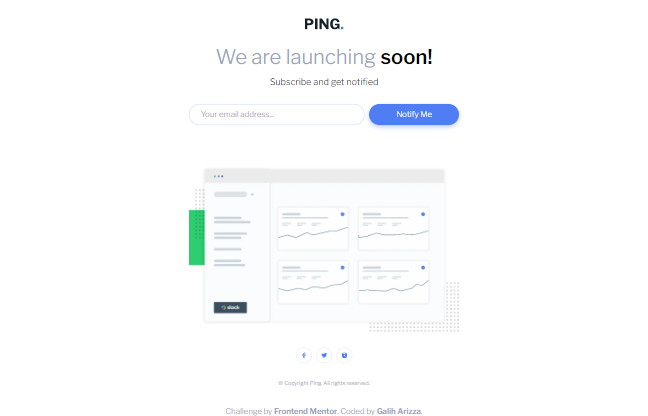

# Frontend Mentor - Ping coming soon page solution

This is a solution to the [Ping coming soon page challenge on Frontend Mentor](https://www.frontendmentor.io/challenges/ping-single-column-coming-soon-page-5cadd051fec04111f7b848da). Frontend Mentor challenges help you improve your coding skills by building realistic projects.

## Table of contents

- [Overview](#overview)
  - [The challenge](#the-challenge)
  - [Screenshot](#screenshot)
  - [Links](#links)
- [My process](#my-process)
  - [Built with](#built-with)
  - [What I learned](#what-i-learned)
- [Author](#author)

## Overview

### The challenge

Users should be able to:

- View the optimal layout for the site depending on their device's screen size
- See hover states for all interactive elements on the page
- Submit their email address using an `input` field
- Receive an error message when the `form` is submitted if:
  - The `input` field is empty. The message for this error should say _"Whoops! It looks like you forgot to add your email"_
  - The email address is not formatted correctly (i.e. a correct email address should have this structure: `name@host.tld`). The message for this error should say _"Please provide a valid email address"_

### Screenshot

### Links

- Solution URL: [https://github.com/chadittya/ping-single-column-coming-soon-page](https://github.com/chadittya/ping-single-column-coming-soon-page)
- Live Site URL: [https://ping-single-column-coming-soon-page-jade.vercel.app/](https://ping-single-column-coming-soon-page-jade.vercel.app/)

## My process

### Built with

- Semantic HTML5 markup
- CSS custom properties
- Flexbox
- CSS Grid
- [TypeScript](https://www.typescriptlang.org/) - JS library
- [Next.js](https://nextjs.org/) - React framework
- [Tailwind CSS](https://tailwindcss.com/) - For styles

### What I learned

During the process of building this project, I learned several things that improved my skills as a developer. Here are some of the most important things I learned:

1. Form handling and validation: The project involved creating a form for users to submit their email addresses. I learned how to handle form submissions using React and how to validate the input to ensure it's in the correct format and not empty.
2. TypeScript: I learned how to use TypeScript to write safer and more maintainable code. By adding static typing and other features to JavaScript, I was able to catch errors earlier in the development process and write more robust code.

Overall, I learned a lot from this project and had a great time building it. I look forward to using these new skills in future projects!

## Author

- Github - [chadittya](https://github.com/chadittya)
- Frontend Mentor - [@chadittya](https://www.frontendmentor.io/profile/chadittya)
- Twitter - [@galiharizza](https://www.twitter.com/galiharizza)
